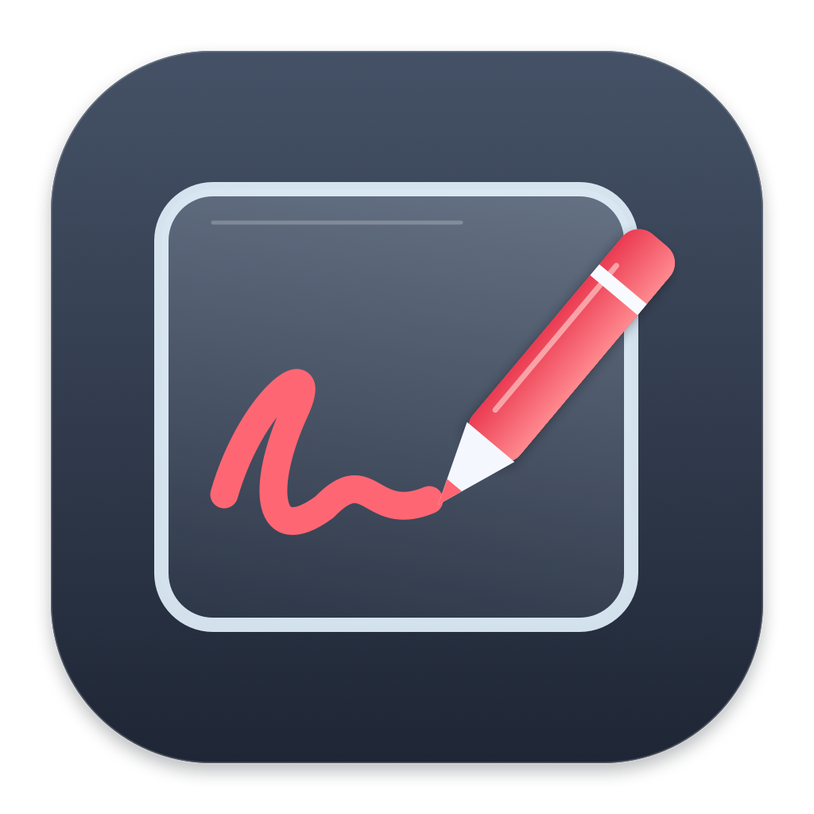

<p align="center"></p>

# 简笔白板 · SimpleBoard

一个轻量的 macOS 白板与桌面批注工具。深色磨砂玻璃工具栏，红色画笔和等宽文字；不登录、不联网、不录屏。

## 功能

- 白色画布与透明桌面批注两种模式，切换时保留内容。
- 画笔、直线、矩形、文字输入和纯文字粘贴。
- 透明模式下选择箭头工具，点击与滚动可穿透至下方应用。
- 撤销、重做、可调整的线宽和文字大小。
- 144 点宽的浮动工具栏，系统原生玻璃背景和文字控件。

**内容仅保存在当前会话。退出或崩溃后不保留，当前没有保存、导出或自动恢复功能。**

## 安装

当前发布包面向 **Apple Silicon（M 系列）Mac，macOS 13 或更新版本**。Intel Mac 尚未提供经过验证的安装包。

下载发布包，解压后将「简笔白板.app」放入「应用程序」。更新前先退出旧版本，再替换原应用，避免留下多个副本。

应用仅使用本地 ad-hoc 签名，**未经过 Apple 公证**。从 GitHub 下载后可能出现系统验证提示；请核验来源后按 macOS 的安全提示处理，或自行从源码构建。不要关闭全局安全保护。

## 快捷键

| 按键 | 操作 |
| --- | --- |
| A | 画笔 |
| Q | 直线 |
| W | 矩形；Shift 拖动为正方形 |
| T | 点击画布输入文字 |
| V | 选择；透明模式下可操作下方应用 |
| Z / ⌘V | 在鼠标位置贴入红色等宽纯文字 |
| C | 清空，不退出；可撤销 |
| X | 清空并退出 |
| ⌘Z / ⌘⇧Z | 撤销 / 重做 |
| ⌘B | 切换白板 / 透明模式 |
| ⌘, | 显示工具面板 |
| ⌘Q | 退出 |

快捷键只在白板处于前台时生效，**不是全局快捷键**。文字输入时，字母正常输入，⌘C 正常复制；Enter 换行、⌘Enter 完成、Esc 取消。切到其他应用后，可点击工具栏继续批注。

## 从源码构建

需要 macOS 和 Xcode 或 Command Line Tools，无第三方依赖。

```sh
bash native/build.sh
```

生成 `outputs/简笔白板.app` 和 `outputs/简笔白板-macOS.zip`。脚本默认编译 arm64，最低部署版本为 macOS 13。

```sh
# 重新生成图标（可选，仓库已包含 PNG 和 ICNS）
bash native/build-icon.sh
# 回归测试
bash native/test.sh
# 构建应用、生成干净源码包、发布包和校验和
bash native/package.sh
```

测试覆盖清空按钮、工具状态、选择模式撤销，以及工具栏和画布的重复绘制。离屏测试不能验证真实桌面的模糊效果、所有输入法或跨应用焦点；发布前还需在实际 macOS 桌面上检查。

## 项目结构

```text
assets/       图标、可编辑矢量绘图源代码
native/       AppKit 应用、测试和构建脚本
docs/         使用及发布说明
CHANGELOG.md  版本记录
```

图标由 `assets/DrawIcon.swift` 中的矢量路径生成，每个分辨率独立绘制，外部为透明背景；不包含第三方品牌图形。应用内工具符号使用系统 SF Symbols，不随源码另行分发符号素材。

## 隐私与限制

- 无网络请求、遥测、账户或后台服务。
- 不申请录屏或辅助功能权限；原生背景模糊不需要截图。
- 仅在用户执行粘贴时读取剪贴板纯文字。
- 减少透明度等系统辅助功能设置会影响玻璃效果。
- 当前画布对应启动时所在屏幕，不提供多屏独立画布管理。

## 贡献与发布

欢迎报告可复现的问题；请提供版本、macOS 版本和操作步骤，不要公开带有个人信息的原始崩溃日志。发布流程见 [docs/RELEASING.md](docs/RELEASING.md)。

## 许可证

本项目采用 [MIT License](LICENSE)，Copyright (c) 2026 MeowFTG。

仓库中的应用代码、文档、原创图标及其绘图源码均按 MIT 许可证提供。应用内使用的系统 SF Symbols 不属于本项目的授权范围，适用 Apple 自身条款。
